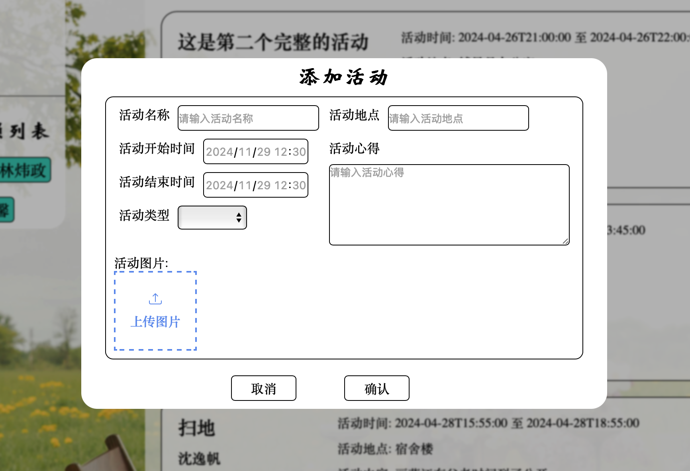

# 学生党员评价管理系统
用 Vue + Django 开发的学生党员评价管理系统,作为软件工程和数据库课程的结课项目，
对于需要项目用于结课等相关需要的同学可以参考这个项目，其中包含了前端和后端的代码。


## 项目功能

作为一个Web应用程序成功实现了增删改查的基础功能，还实现了图片的上传和删除，还实现了活动信息导出为Excel。

| 功能 | 描述 |
| --- | --- |
| 登录 | 用户登录 |
| 首页 | 显示活动列表 |
| 活动详情 | 显示活动详情，可以对活动进行评价 |
| 添加活动 | 添加活动信息 |
| 修改活动 | 修改活动信息 |
| 删除活动 | 删除活动信息 |
| 上传图片 | 上传图片 |
| 删除图片 | 删除图片 |
| 导出Excel | 导出活动信息为Excel |


## 环境搭建
本项目由前端和后端两部分组成，前端使用Vue.js，后端使用Django。
### 前端

#### 安装node.js
前往[node.js官网](https://nodejs.org/zh-cn/)下载安装node.js

#### 安装vue等相关依赖
进入frontend-vue文件夹，运行以下命令安装依赖
```bash
npm install
```

### 后端

#### 安装python
前往[python官网](https://www.python.org/)下载安装python

#### 安装django等相关依赖
进入backend文件夹，运行以下命令安装依赖
```bash
pip install -r requirements.txt
```

## 项目运行

### 1.Linux系统或MacOS系统脚本自动运行
在项目根目录下运行以下命令
```bash
./start_system.sh
```
在运行的命令行中按`Ctrl+C`即可停止项目。

### 2.手动运行
#### 前端
进入frontend-vue文件夹，运行以下命令
```bash
npm run dev
```

#### 后端
进入backend文件夹，运行以下命令
```bash
# 0.0.0.0:8000为后端服务的地址和端口
# 0.0.0.0表示允许任何IP访问
# 若只允许本机访问可以使用127.0.0.1:8000
python manage.py runserver 0.0.0.0:8000
```

## 项目展示

<p align="center">登录页</p>


<p align="center">首页</p>

<center class="half" style="display: flex; align-items: center; justify-content: space-around;">
    
</center>
    <p align="center">活动详情&添加活动</p>

